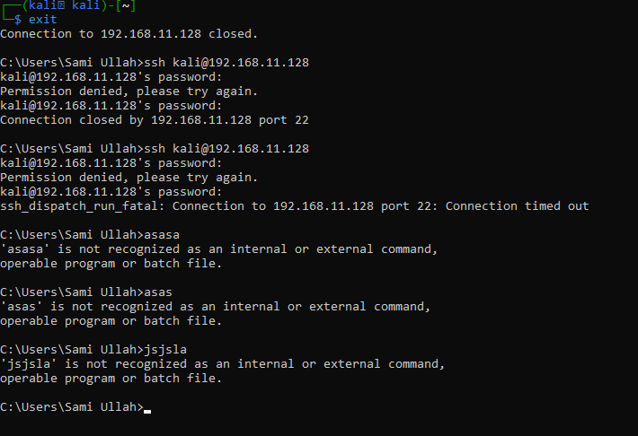
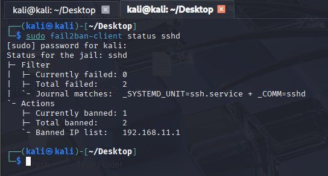

# fail2ban Defence — SSH Brute Force Protection

## What is fail2ban?
fail2ban is an intrusion prevention tool that monitors system logs
in real time. When it detects too many failed login attempts from
the same IP address, it automatically creates a firewall rule to
block that IP completely.

Think of it as an automatic bouncer — after too many wrong attempts,
the door closes permanently for that attacker.

---

## How It Works
```
Attacker tries wrong password
↓
fail2ban reads the log entry
↓
Counter increases for that IP
↓
Counter reaches maxretry limit
↓
fail2ban creates iptables block rule
↓
All connections from attacker IP dropped
↓
Attack completely stopped
```

---

## Configuration Used

| Setting | Value | Meaning |
|---------|-------|---------|
| maxretry | 5 | Ban after 5 failed attempts |
| bantime | 300 | Ban lasts 5 minutes |
| findtime | 60 | Count failures within 60 seconds |
| backend | systemd | Read logs from systemd journal |

---

## Attack Demonstration

### Without fail2ban:
Hydra brute force tool ran completely freely.
All passwords tried with zero interruption.
Correct password found in under 30 seconds.
No blocking. No alerting. No defence.

### With fail2ban Running:

**Phase 1 — Attacker tries wrong passwords from Windows machine:**



The Windows machine attempted SSH login with multiple wrong passwords.
Each failed attempt was silently logged by the system.
The attacker had no idea they were being counted.

---

**Phase 2 — fail2ban detects the pattern and bans the IP:**



After 5 failed attempts within 60 seconds, fail2ban automatically
created an iptables firewall rule blocking the Windows IP completely.
The attacker received "Connection timed out" — the attack stopped dead.

---

## Before vs After Comparison

| Scenario | What Happened | Time To Crack |
|----------|--------------|---------------|
| Without fail2ban | Hydra cracked password freely | Under 30 seconds |
| With fail2ban | IP banned after 5 attempts | Never — attack blocked |

---

## What The Attacker Sees After Ban:
```
ssh_dispatch_run_fatal: Connection to 192.168.11.128 port 22: Connection timed out
```
Complete silence. No error. No response. Connection dead.

---

## What The Defender Sees:
```
Banned IP list: 192.168.11.1
Currently banned: 1
Total failed: 5
```

---

## Key Lesson
fail2ban turns your authentication logs into an active defence system.
It requires zero manual intervention — it detects, it acts, it blocks.
Every SOC analyst should know how to configure and verify fail2ban
on any Linux server they are responsible for protecting.

## Commands To Verify fail2ban:
```bash
sudo systemctl status fail2ban
sudo fail2ban-client status sshd
sudo iptables -L -n | grep <attacker-ip>
```