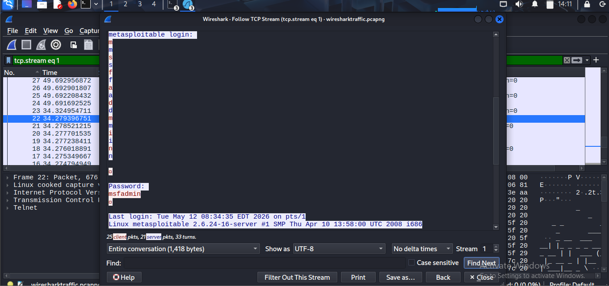

---

## 4. SOC / Blue Team Analysis

| Indicator | Details |
|-----------|---------|
| Protocol | Telnet TCP/23 — no encryption |
| Credential exposure | Username and password in plaintext |
| Detection method | Wireshark → Follow TCP Stream |
| MITRE ATT&CK | T1021.004 — Remote Services |
| Risk | Critical — zero effort to steal credentials |

---

## 5. Defensive Countermeasures

| Action | Command |
|--------|---------|
| Disable Telnet | `sudo systemctl stop telnetd && sudo systemctl disable telnetd` |
| Block port 23 | `sudo iptables -A INPUT -p tcp --dport 23 -j DROP` |
| Replace with SSH | `ssh msfadmin@192.168.6.129` |
| Detect Telnet traffic | Wireshark filter: `tcp.port == 23` |

---

## 6. Key Takeaways

- Telnet has zero encryption — every keystroke including passwords travels as raw plaintext.
- Any attacker on the same network can passively capture credentials without any active attack.
- As a SOC analyst, any Telnet traffic on your network is an immediate alert — either a legacy device needing remediation or an active threat.
- Always replace Telnet with SSH in any real environment.

---

*Lab performed in an isolated VMware Host-Only network. Target is intentionally vulnerable (Metasploitable2). Never perform these techniques on systems you do not own.*